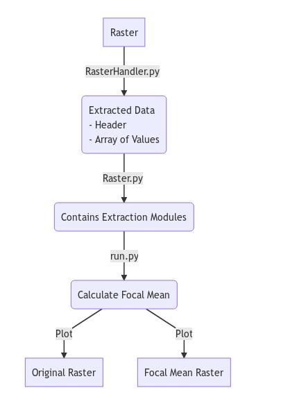

# Focal Mean Calculation 

This function builds and plots the focal mean of a given raster in .txt format.
Just fork or download the files and use execute run.py

```run
python3 run.py
```

The files contain also a sample dataset which is called by default. 
To specify your own dataset use the --path flag followd by the path to your file

```run2 
python3 run.py --path ~/data/myraster.txt
```

## Functionality

